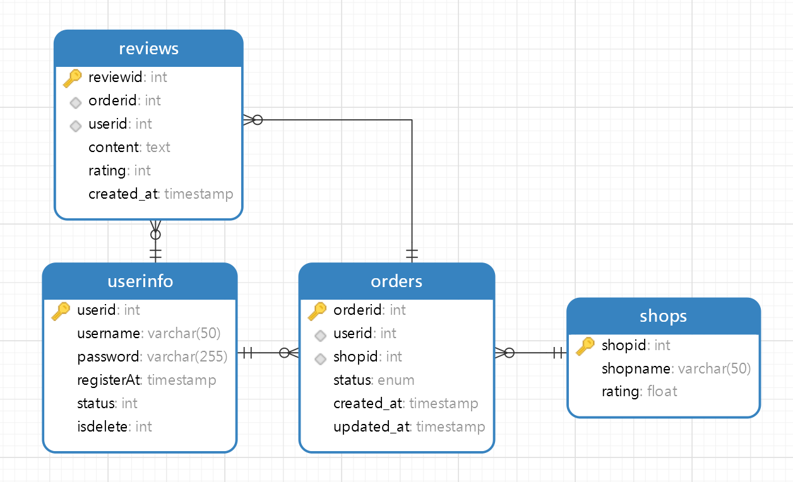

# Order_Management_System

初始化项目

~~~shell
cd Order_Management_System
go mod init github.com/jjyaoao/Order_Management_System
go mod tidy
~~~

若无法下载import依赖，请在命令行输入：

~~~shell
go env -w GO111MODULE=on
go env -w GOPROXY=https://goproxy.cn,direct
~~~

